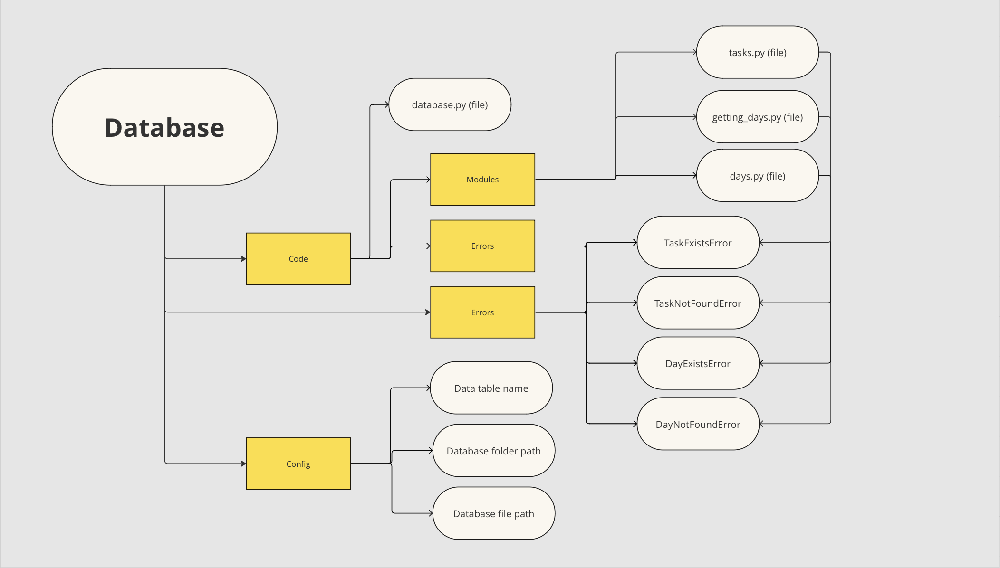

# Ambitify database
Ambitify planner database written in Python<br>

This code will be used in the Ambitify planner.
Since it is open source, you can develop your own planner using this code and modify it as well.

# How to use
1. Download the project from GitHub
2. Move the src folder to your project
3. Change the src folder to the database folder
3. Import the database folder into a file and create an object of the Database class

```python
import database


db = database.Database()
```

4. Now you are ready to work with the database

# Methods of the Database class

```python
.add_day(day: str) -> None
```
---
Create a new day<br>
day is the name of the day

```python
.rename_day(day: str, new_name: str) -> None
```
---
Change day<br>
day - name of the day that needs to be renamed<br>
new_name - new name of the day

```python
.delete_day(day: str) -> None
```
---
Delete day<br>
day - name of the day to be deleted

```python
.add_task_to_day(day: str, time: str, comment: str) -> None
```
---
Create a new task for the day<br>
day - name of the day to which you want to add the task<br>
time - time when you need to start doing the task<br>
comment - comment for the task

```python
.change_task_to_day(
            self, day: str, time: str,
            new_time: str=None, new_comment: str=None, new_progress: int=None) -> None:
```
---
Change task for day<br>
day - name of the day in which you want to change the task<br>
time - time/task name<br>
new_time - New time/new task name<br>
new_comment - new comment for the task<br>
new_progress - new task progress

If you don't want to change any parameter, just leave it out

```python
.delete_task_from_day(self, day: str, time: str) -> None:
```
---
Remove a task from a day<br>
day - name of the day from which you want to delete the task<br>
time - time/job name

```python
.get_day(self, day: str) -> tuple:
```
---
Get data about the day<br>
day - name of the day<br>
Returns a list, where 1 element is the name of the day, and the second is the tasks for it

```python
.get_days(self) -> tuple:
```
---
Returns a tuple of tuples, where each tuple is the name and tasks of the day

# Changing database settings
By default, the database saves days and tasks along the path folder_where_you_run_the_database/data/schedule.db<br>
If you want to change this, then open the config.py file in the database folder

```python
"""
Database settings
© Andboogl, 2024
"""


import os


DATA_TABLE_NAME = 'schedule'
DATABASE_FOLDER_PATH = os.path.join('.', 'data')
DATABASE_FILE_PATH = os.path.join(DATABASE_FOLDER_PATH, 'schedule.db')
```
And you can change the following parameters:<br>
DATABASE_FOLDER_PATH - path to the folder where the database file will be located<br>
DATABASE_FILE_PATH - path to the database file. The folder is pulled automatically<br>
DATA_TABLE_NAME - name of the table in which all data will be stored<br>

<span style='color: rgb(222, 1, 1); font-weight: 800;'>ATTENTION:</span> Changing any parameter will lead to the loss of all data that was in the old database.

# Project structure

